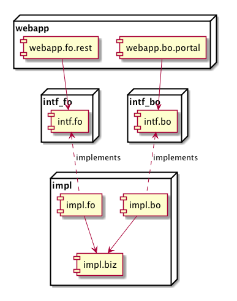

#Srb4j


__Srb4j__ (pronounced "/srəb/ for J") is a Java RESTFul backend code skeleton, with __common response data structures__, __user/password/access-token support__, __social login__ and __API document generation__.

It can collaborate with __html clients__, __mobile clients__ and other types of clients such as __desktop applications__ at the same time.  

__With Srb4j you can launch a restful backend in several minutes.__ 

__Checkout a demo client right away__ at http://srb4jclient.chenjianjx.com:8000/ , or install an __Android__ client on https://github.com/chenjianjx/Srb4jAndroidClient, or download a __desktop__ client on https://github.com/chenjianjx/srb4j-desktop-client .

__You can also see its out-of-box RESTFul APIs [here](https://srb4jdemo.chenjianjx.com/fo-rest-doc) .__


Table of Contents
=================
  * [Summary of Features](#summary-of-features)
  * [Prerequisites](#prerequisites)
  * [Quick Start for Backend Developers](#quick-start-for-backend-developers)
  * [Quick Start for Client\-Side Developers](#quick-start-for-client-side-developers)
  * [Things the Backend Developers should Know](#things-the-backend-developers-should-know)
  * [Social Login Integration](#social-login-integration)
  * [API Documentation and Client Stub Generation and Online Testing](#api-documentation-and-client-stub-generation-and-online-testing)
  * [The Back Office](#the-back-office)

# Summary of Features

1. Registration/login based on standard OAuth2 password flow (access tokens, refresh tokens, etc.)
2. Social account login support (Google,Facebook...) 
3. Password resetting and random code login  
4. [Swagger](http://swagger.io/)-based API document generation and client stub generation
5. Popular J2EE Stack: JAX-RS + Spring + MyBatis + MySQL
6. Modularized structure design enforcing loose coupling between components
7. An out-of-box back office web portal

# Prerequisites
1. JDK 7+
2. Servlet 3.0+ Container such as Tomcat 7
3. MySQL Server


<!-- toc -->

# Quick Start for Backend Developers

### Generate a Java project

````bash
cd /path/to/your/workspace

mvn -X archetype:generate \
-DarchetypeGroupId=com.github.chenjianjx -DarchetypeArtifactId=srb4j -DarchetypeVersion=1.2.0 \
-DgroupId=your.groupId  \
-DartifactId=yourArtifactid \
-Dpackage=your.pkg.name \
-Dversion=1.0-SNAPSHOT \
-DarchetypeRepository=https://jitpack.io

````

### Create a MySQL database and its tables

Create a db and a user

````SQL
	mysql> create database yourdb default character set utf8;	 ## Has to be utf8
	mysql> create user 'your_user'@'localhost' identified by 'your_password';
	mysql> grant all privileges on yourdb.* to 'your_user'@'localhost' with grant option;	
````

Create tables
````bash
cd /some/dir
wget https://raw.githubusercontent.com/chenjianjx/srb4j/master/src/main/resources/archetype-resources/doc/sql/ddl.sql  #Download this file with a browser if you are using windows
````
````SQL
mysql> use yourdb;
mysql> source /some/dir/ddl.sql;
````  

### Setup Env-specific properties 
````bash
mkdir ~/yourArtifactId  #For windows, replace "~" with your user's home directory
cd ~/yourArtifactId
wget https://raw.githubusercontent.com/chenjianjx/srb4j/master/src/main/resources/archetype-resources/doc/app.properties.sample -O app.properties  #Download this file with a browser and renmae it to app.properties if you are using windows
````

Then edit app.properties according to your environment.
````bash
vi app.properties
````
 
### Build the Java project 
````bash
cd /path/to/your/workspace/yourArtifactid

mvn install -DskipTests

cd webapp

mvn jetty:run -Djetty.port=yourPort

````

### Verify the installation

Open http://locahost:yourPort in a browser to verify the startup


# Quick Start for Client-Side Developers 

## Refer to the API doc 

The API doc has been generated on your backend at http://your-backend/fo-rest-doc 

## Sample Code For HTML and Javascript Developers

````javascript		 
	    	//login
			$.ajax({
				async: false,
				url: "http://localhost:8080/fo/rest/token/new/local",
				type: "POST",
				contentType: 'application/x-www-form-urlencoded',				
				data: "grant_type=password&username=chenjianjx@gmail.com&password=abc123",
				success: function(data, statusText, xhr){					
					console.log(data.access_token); //You can save this token to cookie or LocalStorage
					console.log(data.refresh_token);
					console.log(data.expires_in);
					console.log(data.user_principal); // the full user name			
					 
					
				},
				error: function(xhr,statusText, e){
					console.log(xhr.status)										
					var response = $.parseJSON(xhr.responseText);
					console.log(response.error); // "the error code"
					console.log(response.error_description); // "the error description for developers"
					console.log(response.error_description_for_user); // "user-friendly error desc for users"
					console.log(response.exception_id); // "the server side developer can use this id to do troubleshooting"
				}				
			});

			...
			
			// call a business web service
			$.ajax({
				async: false,
				url: "http://localhost:8080/fo/rest/bbs/posts/new",
				type: "POST",
				contentType: 'application/json',
				headers: {					 
					'Authorization': "Bearer " + accessToken
				},				  
				data: JSON.stringify({content:"my-first-post"}),
				success: function(data, statusText, xhr){					
					console.log(data); 
				},
				error: function(xhr,statusText, e){
					console.log(xhr.status);
					
					if(xhr.status == 400 || xhr.status == 401 || xhr.status == 403){// "token error"						 
						var authHeader = xhr.getResponseHeader("WWW-Authenticate");// "See https://tools.ietf.org/html/rfc6750#page-7"
						console.log(authHeader); 
						//in this case, you can redirect the user to login 
					}
					else if (xhr.status == 460) { // "biz error"
						var response = $.parseJSON(xhr.responseText);
						console.log(response.error); // "the error code"
						console.log(response.error_description); // "the error description for developers"
						console.log(response.error_description_for_user); // "user-friendly error desc for users"
						console.log(response.exception_id); // "the server side developer can use this id to do troubleshooting"
					}else{
						console.log(xhr.responseText);
					}
						
				}
					
					
				
			});
			
			...
			
			//logout
			$.ajax({
				async: false,
				url: "http://localhost:8080/fo/rest/token/delete",
				type: "POST",
				contentType: 'application/json',
				headers: {					 
					'Authorization': "Bearer " + accessToken
				}				  				 								
			});			
			
		});			
			
```` 

Check out more code [here](https://github.com/chenjianjx/srb4j-html-client) .


## Sample Code For Desktop and Mobile Developers
 
````java

import com.mashape.unirest.http.HttpResponse;
import com.mashape.unirest.http.JsonNode;
import com.mashape.unirest.http.Unirest;
...

		// do login
		HttpResponse<JsonNode> loginResponse = Unirest
				.post("http://localhost:8080/fo/rest/token/new/local")
				.header("Content-Type", "application/x-www-form-urlencoded")
				.field("grant_type", "password")
				.field("username", "chenjianjx@gmail.com")
				.field("password", "abc123").asJson();

		if (loginResponse.getStatus() == 200) {
			JSONObject token = loginResponse.getBody().getObject();
			System.out.println(token.get("access_token")); //You can save the token for later use
			System.out.println(token.get("refresh_token"));
			System.out.println(token.get("expires_in"));
			System.out.println(token.get("user_principal")); // "the full user name"			
		} else {
			System.out.println(loginResponse.getStatus());
			System.out.println(loginResponse.getStatusText());
			JSONObject error = loginResponse.getBody().getObject();
			System.out.println(error.get("error")); // "the error code"
			System.out.println(error.get("error_description")); // "the error description for developers"
			System.out.println(error.get("error_description_for_user")); // "user-friendly error desc for users"
			System.out.println(error.get("exception_id")); // "the server side developer can use this id to do troubleshooting"
		}
		...
		
		
		// call a business web service
		NewPostRequest bizRequest = new NewPostRequest();
		bizRequest.setContent("my-first-post");
		HttpResponse<String> bizResponse = Unirest
				.post("http://localhost:8080/fo/rest/bbs/posts/new")
				.header("Content-Type", "application/json")
				.header("Authorization", "Bearer " + accessToken)
				.body(toJson(bizRequest)).asString();

		if (bizResponse.getStatus() == 200) {
			Post post = fromJson(bizResponse.getBody(), Post.class);
			System.out.println(post);
		}

		else if (Arrays.asList(400, 401, 403).contains(bizResponse.getStatus())) { // "token error"
			String authHeader = bizResponse.getHeaders()
					.get("WWW-Authenticate").get(0);// "See https://tools.ietf.org/html/rfc6750#page-7"			
			System.out.println(bizResponse.getStatus());
			System.out.println(authHeader); //You can also further parse auth header if needed. Search "decodeOAuthHeader" in this repository.  
			//You should then redirect the user to login UI
		}

		else if (bizResponse.getStatus() == 460) { // "biz error"
			JSONObject error = new JSONObject(bizResponse.getBody());
			System.out.println(error.get("error")); // "the error code"
			System.out.println(error.get("error_description")); // "the error description for developers"
			System.out.println(error.get("error_description_for_user")); // "user-friendly error desc for users"
			System.out.println(error.get("exception_id")); // "the server side developer can use this id to do troubleshooting"
		} else {
			System.out.println(bizResponse.getStatus());
			System.out.println(bizResponse.getBody());
		}
		
		...

		// logout
		Unirest.post("http://localhost:8080/fo/rest/bbs/posts/delete")
				.header("Content-Type", "application/json")
				.header("Authorization", "Bearer " + accessToken).asJson();

````

Check out more code [here](https://github.com/chenjianjx/srb4j-desktop-client) or [here](https://github.com/chenjianjx/Srb4jAndroidClient) . 


# Things the Backend Developers should Know

## User Model

1. Every user has a "source" property to indicate where this user is from. "local" means the user registers here, "facebook" means the user is created when he logged into the backend with a facebook account.
2. source + email make up of a username, the business key.

## Create a business module 

A business module called "bbs" is already there to demonstrate how to develop biz logic in srb4j. You can create your own by referring to "bbs" code files:  

1. Table 'Post' in ddl.sql
2. Biz entity and repository(DAO) classes in package 'yourpackage.impl.biz.bbs' 
3. App-layer beans and managers in package 'yourpackage.intf.fo.bbs' and  'yourpackage.impl.fo.bbs'
4. RESTFul Resources in package 'yourpackage.webapp.fo.rest.bbs'  


Note: 
1. You can delete package 'yourpackage.impl.biz.bbs' if you don't it any more.
2. For layers and maven artifacts in srb4j, see below.  

## The code organization

* The layers:
  


* Notes:
  * Front End:   Encapsulate use case-specific logic from business services. The users are common users such customers.
  * Back Office: Encapsulate use case-specific logic from business services. The users are administrators, staff and so on.


* And you get these maven projects: 



* Notes 
  * "webapp" has "runtime" dependency on "impl"
  * "intf.bo" depends on "intf.fo" since back office users also need common-user perspectives.
  * Check full explanation [here](http://www.chenjianjx.com/myblog/entry/layering-in-java-webapps-final)   

# Social Login Integration

## Basic Flow

1. The client obtains an auth code or an access token/id token from the social website after the user has loggged into a social website
2. The client then exchanges this code or token with the backend for srb4j's access token
3. The backend will verify the code or token against the social website's server, before it sends an access token to the client

## Integrate with this or that social site 

* [Google + Html Client](documents/userguide/social-integration/google_html.md)
* [Google + Mobile Client](documents/userguide/social-integration/google_mobile.md)
* [Google + Desktop Client](documents/userguide/social-integration/google_desktop.md)
* [Facebook + Html Client](documents/userguide/social-integration/facebook_html.md)
* [Facebook + Mobile Client](documents/userguide/social-integration/facebook_mobile.md)
* [Facebook + Desktop Client](documents/userguide/social-integration/facebook_desktop.md)
* ...
* [Integrate a new social site](documents/userguide/social-integration/new_site.md) 

# API Documentation and Client Stub Generation and Online Testing

Thanks to [swagger](http://swagger.io/), you can have a WSDL-like API document of your restful web services with [swagger-ui](https://github.com/swagger-api/swagger-ui), generate client stubs with [swagger-codegen](https://github.com/swagger-api/swagger-codegen) and test the services with a [web-ui](https://github.com/swagger-api/swagger-ui). 

Srb4j has embedded swagger support. The document endpoint is http://your-backend/fo/rest/swagger.json . If you know swagger well, you know what to do.

If you just want to see a download-able API doc, check http://your-backend/fo-rest-doc , which is generated by [swagger2html] (https://github.com/chenjianjx/swagger2html).    

It may be vulnerable to expose the API doc or testing-web-ui in a PROD system. You can disable swagger (and the API doc) by editing app.properties and restart:  
````
enableSwagger=false
```` 

# The Back Office

The back office code is just a way to demonstrate how a back office web portal can interact with the app layer. It enforces the code organization so that back-office code is separated from front end code. 

If you don't need the back office web portal, please delete the following content: 
 
* BoAllInOneServlet.java
* Its occurrence in web.xml